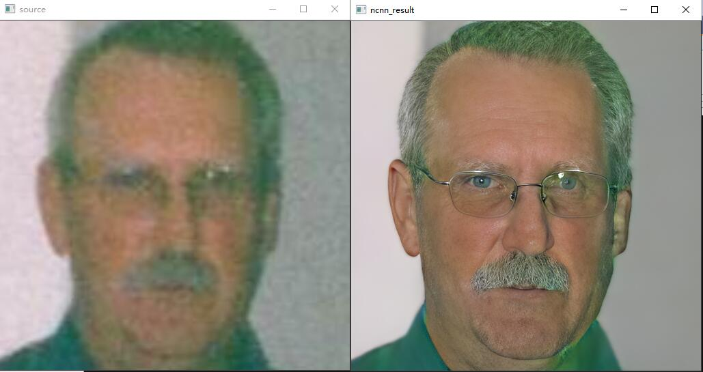
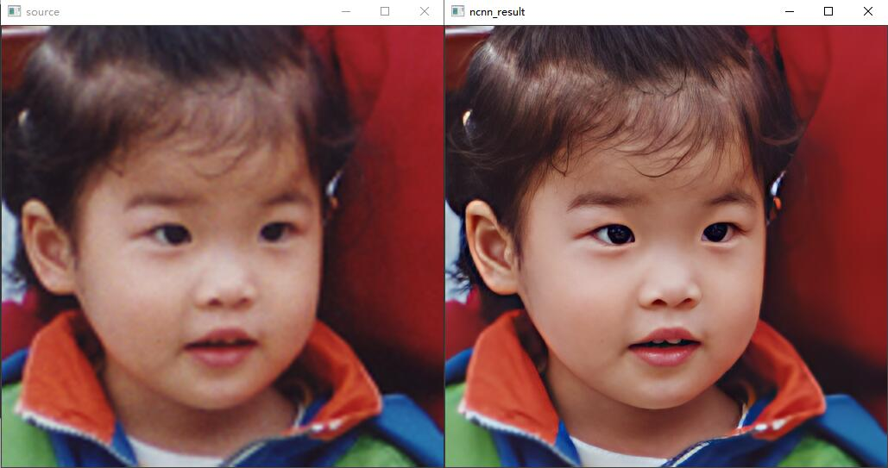
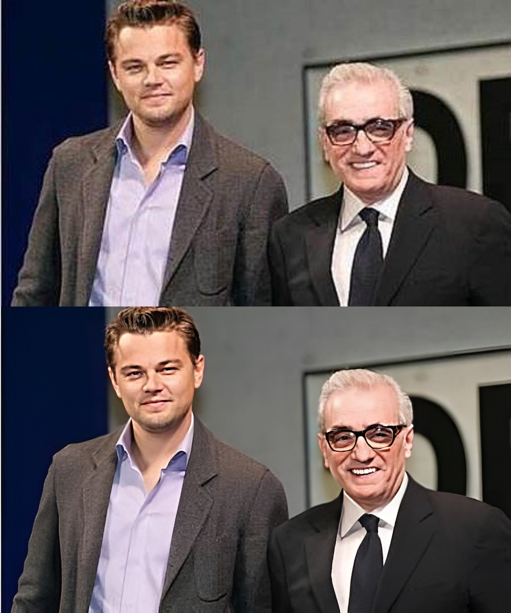

# GFPGAN-ncnn  
a naive ncnn implementation of **GFPGAN aims at developing Practical Algorithms for Real-world Face Restoration**  
## model support:  
### 1.GFPGANCleanv1-NoCE-C2 
All models are available in [Baidu Pan](https://pan.baidu.com/s/1zbVwK7kh6uVfWgq9AZDJDA) (i4xb)  

### TODO:  
1.whole image restore  
2.windows gui demo  
3.support ncnn-vulkan  
4.model with colorization
## Result 
  
  
  

## Reference  
1.https://github.com/xinntao/Real-ESRGAN  
2.https://github.com/TencentARC/GFPGAN  
3.https://github.com/xinntao/Real-ESRGAN-ncnn-vulkan  
3.https://github.com/Tencent/ncnn  
4.https://github.com/deepcam-cn/yolov5-face  